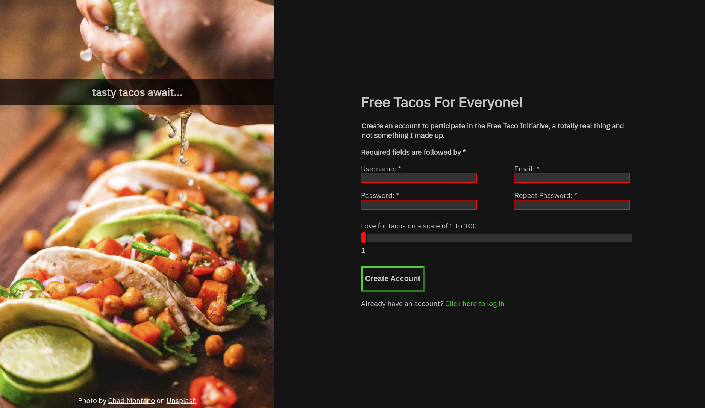

# Taco-Form

The Landing Page project from [The Odin Project](https://www.theodinproject.com/)

## [Live Demo](https://gustav72.github.io/Taco-Form/)

### Technologies Used

HTML5

CSS3

Git

### Overview

This is a user friendly taco enthusiast form with client side validation using HTML and CSS. The required inputs will be accessible for those who use screen readers.

This project demonstrated the use of pseudo selectors, basic client side input validation, and styled for each major browser.

Thank you for taking the time to view my work! I am on a journey to become a front end web developer.

Terrific Tacotography taken by Chad Montano and downloaded from unsplash.com.
